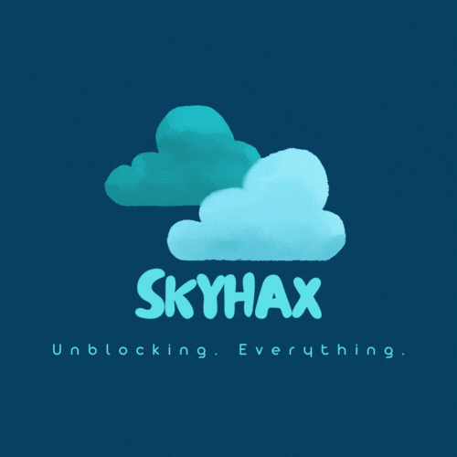

 

  

  <h3 align="center">DuckOS v6</h3>

  

    A purely static web-based operating system designed to combat internet censorship.
     
    <a href="https://github.com/GikitSRC/DuckOS/wiki"><strong><< Documentation for developers >></strong></a>
     
     
    <a href="https://skyhax.xyz/directories/duckos.html">Quick Demo</a>
    ·
    <a href="https://skyhax.xyz">Official Website</a>
    ·
    <a href="https://discord.gg/MxRvwQjrAa">Discord Server</a>
  

---

<!-- ABOUT THE PROJECT -->
## About DuckOS 🪐

There are so many web-based operating systems out there for this purpose... (I won't call out names) but I never tought they feel like a real Operating System. That's when I got the idea of creating my own web-based operating system, with a unique look and packed with features, having a goal of being at least 90% bug-free and easy to use. But why should you choose to use DuckOS over the others?

Here's why:
* Meets the standards. Modern, simple and user-friendly interface.
* Powerful. Equipped with the best flagship proxies to help you go on unblocked sites.
* Flexible. Easily customize, develop and integrate.

Of course, DuckOS isn't created to replace your real Operating System (MacOS, Windows, etc). It will always be a project I made just for fun, with NO GOALS OF MAKING SCHOOL DISTRICTS CHASE AFTER ME

Find our website's link on the `top of the page`

(<a href="#readme-top">back to top</a>)

---

<!-- GETTING STARTED -->
## Self-Hosting 💾
These are instructions on hosting DuckOS by yourself.

### Prerequisites

* 28MB of Disk Space (1MB if you replace the images with FontAwesome)
* Your own Domain
* Static Web Hosting Service

### Installation

1. Make a fork DuckOS's Github Repo
2. You can host DuckOS on a static web hosting service like [Netlify](https://www.netlify.com/) or [Cloudflare Pages](https://pages.cloudflare.com/) (There are many other options available)  

**That's it! With just two steps, you can get DuckOS up and running ;) However, if you want dynamic proxies to work, you'll have to do a bit more work and add a subdomain accordingly with the proxies app.**

(<a href="#readme-top">back to top</a>)

---

<!-- CONTRIBUTING -->
## Contributing 🦮

Contributions are what make the open source community such an amazing place to learn, inspire, and create. Any contributions you make are **greatly appreciated**.

If you have a suggestion that would make this better, please fork the repo and create a pull request. You can also simply open an issue with the tag "enhancement".
Don't forget to give the project a star! Thanks again!

1. Fork the Project
2. Create your Feature Branch (`git checkout -b feature/AmazingFeature`)
3. Commit your Changes (`git commit -m 'Add some AmazingFeature'`)
4. Push to the Branch (`git push origin feature/AmazingFeature`)
5. Open a Pull Request

(<a href="#readme-top">back to top</a>)

---

<!-- LICENSE -->
## License 📝

Distributed under the Apache 2.0 License. See `LICENSE.txt` for more information.

(<a href="#readme-top">back to top</a>)

---

<!-- CONTACT -->
## Contact 📱

### XENITHZ - DISCORD: codecorruption

### justinkk - Discord: justinkk1

### Colbster937 - [Email](mailto:colbster937@colbster937.dev) - [Profile](https://colbster937.dev) - Discord: Colbster937

[Discord Server](https://discord.gg/MxRvwQjrAa)

Project Link: [DuckOS Demo](https://skyhax.xyz/directories/duckos)

(<a href="#readme-top">back to top</a>)

---

<!-- ACKNOWLEDGMENTS -->
## Acknowledgments 🤭

Resources that made DuckOS possible.

* [Apache 2.0 License](license.txt)
* [Fontawesome](https://fontawesome.com/)
* [JQuery](https://jquery.com/)
* [Visual Studio Code](https://code.visualstudio.com/)
* [Canva](https://www.canva.com/)
* [Github](https://github.com)
   

(<a href="#readme-top">back to top</a>)

